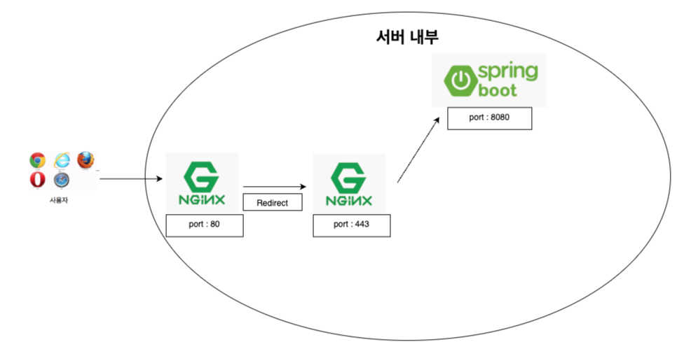

# 📌 WorkConGW
>기존 4인 팀프로젝트 WorkConGW를 배포 (1인)  
> https://workcongw.store  
> 테스트 계정: ID: 00001 ~ 00005  
> 테스트 계정 PW: 1024

 

## 1. 제작 기간 & 참여 인원
- 2024.07 ~ 2024.08
- 개인 프로젝트

 

## 2. 사용 기술 :
- AWS EC2
- Docker
- Docker-Compose
- Nginx (Reverse Proxy)
- DNS

 

## 3. 배포 구조 :

 

## 4. 핵심 설명 :
- Docker를 이용하여 AWS EC2 환경에 배포
- Docker-compose 를 활용하여 여러개의 컨테이너를 관리
- 기존에 고려하지 않던 Web Server를 백엔드 서버 앞단에 위치하여 Reverse proxy 사용
- SSL 인증서를 발급하여 HTTPS 프로토콜 사용
- 도메인을 구입하여 DNS 사용

 

## 5. 트러블 슈팅

 
데이터 타입 문제

 <blockquote>
기존 데이터베이스에서 CHAR 타입을 사용하는 컬럼이 많았다.  
CHAR 타입은 고정길이 문자형이라 빈 문자열은 공백으로 채워지는 문제로 Mybatis에서 제대로 인식을 하지 못해서 VARCHAR2 타입으로 변경했다.
 </blockquote>

 

EC2 프리티어 스왑 메모리

 <blockquote>
이번 프로젝트에서 AWS EC2 프리티어를 사용했다. 
프리티어 에서는 램 용량이 1GB가 제공되는데, 나는 EC2 인스턴스에 Docker로 환경을 구성했더니 
1GB 램으로는 버티질 못해서 인스턴스가 꺼지는 문제가 있었고, 이를 위해 EC2 인스턴스에 메모리 스왑 2GB를 할당했다 
메모리 용량 부족으로 인스턴스가 꺼지는 이슈를 해결할 수 있었다.
 </blockquote>

 

Docker-Compose 문법

 <blockquote>
기존 Docker를 사용하면서 Docker Image를 Pull 받고, 
Docker run 명령어를 통해 컨테이너를 관리 했다. 
하지만 이번 프로젝트로 여러개의 컨테이너를 관리해야 했고, 
일일히 Docker run 명령어를 통해 관리하기 어려웠다. 
Docker-Compose 기술을 사용했고, Spring Boot는 개인 Docker hun에 Push 했다. 
Docker-Compose 문법으로 여러개의 컨테이너를 관리할 수 있었다. 
 </blockquote>

 

## 6. 회고
> 기존엔 Web Server를 사용하지않고 WAS만을 사용했다.  
> 이번 배포 프로젝트로 인해 Web Server를 왜 사용해야하는지, 앞단에 Web Server를 두어야하는 이유를 잘 알게됐다.  
> 또한, Docker를 사용해보면서 가상 컨테이너 기술의 흥미를 느꼈고, 앞으로도 개발 환경을 구성할때 Docker를 잘 사용할 것 같다.
> DNS서버의 작동원리와 전반적인 웹 흐름을 배포 해보면서 더 자세히 이해할 수 있는 좋은 경험 이였다.
